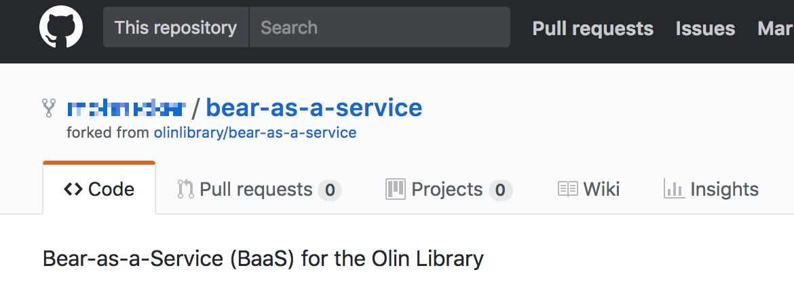
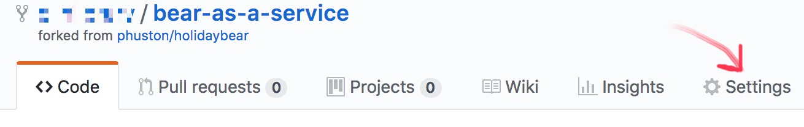
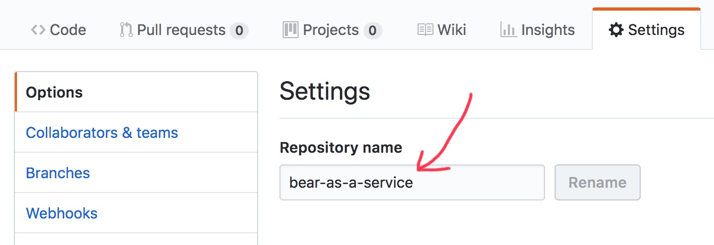
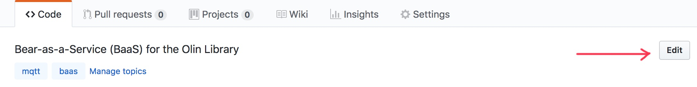
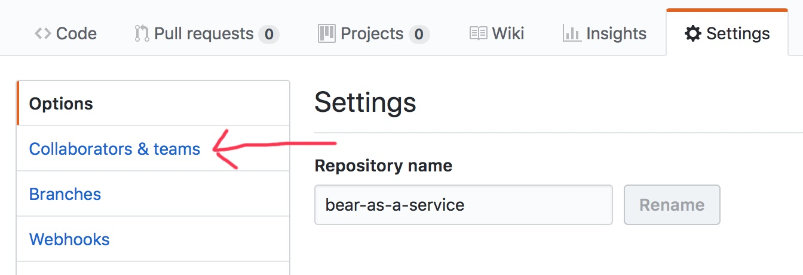

If you cloned `olinlibrary/bear-as-a-service`, your repo looks like this:

You don't want this! It doesn't reflect your project name. The description is
wrong. Also, if you haven't modified the repo settings or boilerplate files
since, there's probably other information that's out of date too.

Here's what to do:

## 1. Rename the repo

On the Github repo home page, click the "Settings" tab.

The top Setting is "Repository name". Rename your to something that reflects your project name.

You *don't* need to update your bookmarks and git remotes (although you can). If
you rename your repo from `bear-as-a-service` to `unbearably-clever-name`,
`https://github.com/myname/bear-as-a-service` will redirect to
`https://github.com/myname/unbearably-clever-name`, and local git repositories
with a remote origin of `https://github.com/myname/bear-as-a-service.git` will
be redirected to the new repository location.

## 2. Update the repo description

Back to your repo's GitHub home page. Click the Description button, and update
or remove the repo description.

## 3. Add your repo collaborators

Click "Collaborators & Teams", in the left hand nav. Add your team members.

This prevents some issues that we've seen more than once in SoftDes, involving
late nights, last minute changes, and the flu. You're unlikely to run into this
on this *particular* project, but it's a good habit to get into.

## 6. Update the README

Remove everything from the README that is not true of *your* project.

Create an "Credits" section. This is where you list outside help that you
received, and any code in the repo that you didn't write[^1]. **This is very
important.** Cite the forked repo here; update it with

Create an "Authors" section. List yourselves.

## 5. Remove unused files

\[It may take you longer than today to figure out which forked files you're
keeping. Do it before code complete.\]

If there's files you aren't using in your project, remove them. (`git rm`, or
just delete them however you'd delete any other file and then commit the
removal). As a matter of hygiene, your repo shouldn't generally contain code
that isn't used, or doesn't relate to your project's features. This invariant
makes it easier to debug, maintain, and extend code in the future — there's less
total code, and less guessing game about what *code* matches what *functionality
and behavior*.

## Final Notes

These steps aren't necessary when you're forking a repo in order to apply your
own fixes or minor extensions to what is basically the same project, and/or to
prepare a pull request. They're necessary here because you're using creating a
*different project*, with a different purpose and goals. In this case, you're
using the repo as a *starter kit*. This is one common use of a repo, although
often in this case you'll clone the repo instead of forking it.

[^1]: You needn't list help from your professor and ninja's. You *should* list
      *all code contributions*, and help from anyone beyond instructional staff.
