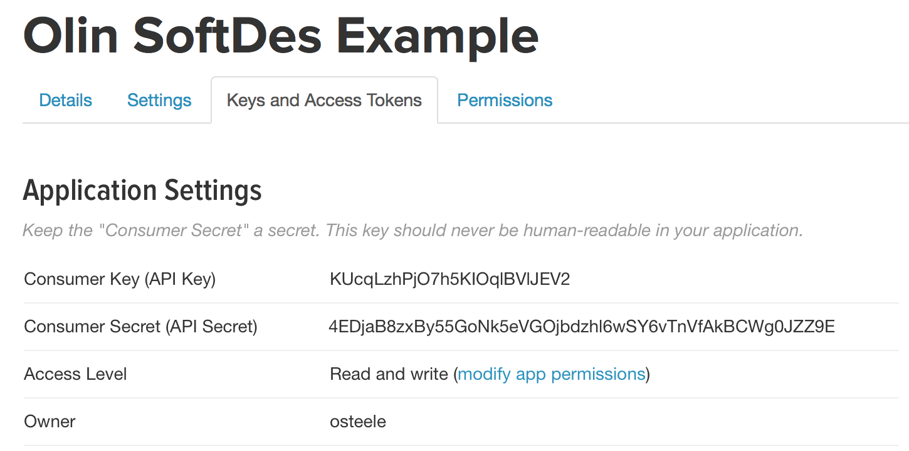
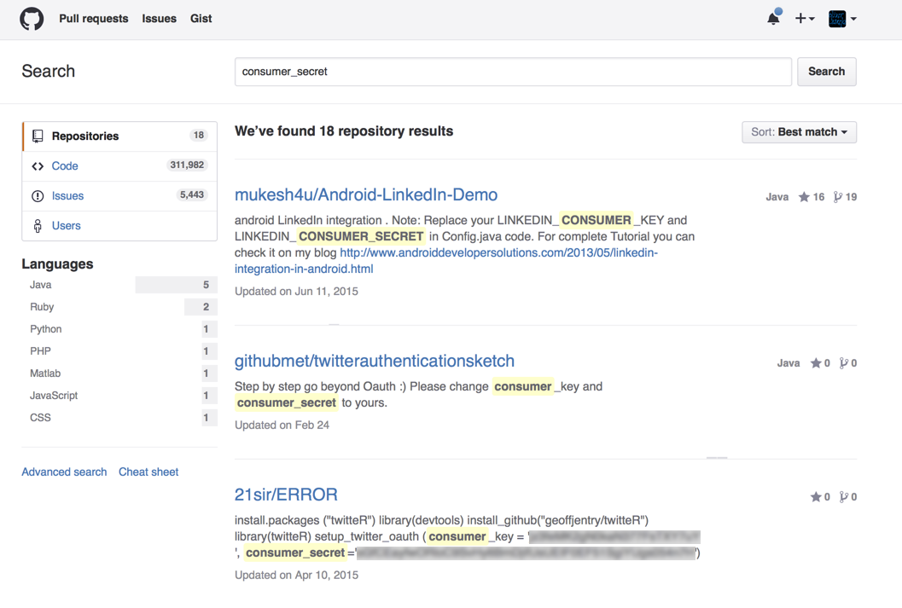

## The Problem

Here's a program that uses the Python [tweepy](https://github.com/tweepy/tweepy)
package to search Twitter for tweets.

```python
import tweepy

consumer_key = 'KUcqLzhPjO7h5KIOqlBVlJEV2'
consumer_secret = '4EDjaB8zxBy55GoNk5eVGOjbdzhl6wSY6vTnVfAkBCWg0JZZ9E'
auth = tweepy.OAuthHandler(consumer_key, consumer_secret)
api = tweepy.API(auth)

for tweet in api.search('olin', lang='EN'):
    print tweet.text
```

    Olin is looking for a #Summer #Co-op in #Plaquemine, apply now! #jobs https://t.co/ii8az2lPr1
    Olin Chlor Alkali is hiring! #Summer #Co-op in #Plaquemine, apply now! #jobs https://t.co/1abk81NjsD
    Marketing Manager, Olin-Fudan EMBA Program: The Olin-Fudan EMBA program is one of the most respec... https://t.co/pKEcpPOvLL #jobs #china
    Apply now to work for Olin Chlor Alkali as #Maintenance #Instrument Technician in #Plaquemine #jobs https://t.co/946vTd3QNz

### Secrets

Note the `consumer_key` and `consumer_secret`. These are necessary in order to use the
Twitter API. (Many other web service APIs work similarly.)

I created these keys by following these steps:

1. Visit <https://apps.twitter.com>
2. Create a new app (“Olin SoftDes Example”)
3. Click “Keys and Access Tokens”. See the screenshot below.



### Publishing your secrets

Now add the file with this code to your repository, and push it to GitHub.

What could go wrong?

I didn't actually publish this code to GitHub, but the screenshot below shows
one way to discover the API keys of users who did.



There are (at least) three problems with publishing your secrets to GitHub like this:

1. People will start using your API key, and this will cut into your API limits
   → your application stops working.
2. You can't (easily) share your code with someone who uses a different API key.
   They have to edit your code; when you publish a new version, they have to
   remember to edit it again.
3. An attacker can use your API code to spam Twitter, and then one or more of:
   you get blamed for it; your application key is revoked (→ your application
   stops working); your application is revoked (→ your application stops
   working, and it's harder to fix it); your account is suspended (and it's even
   harder to fix it).
4. It looks unprofessional. (Because of reasons #1-3.)

## Solution: Environment Variables

Here's the solution that works best with code that will be deployed to a
production environment.

Place the secret in an [environment variable](https://en.wikipedia.org/wiki/Environment_variable),
and modify the source code to read from this variable:

```python
import os
import tweepy

consumer_key = os.environ['TWITTER_CONSUMER_KEY']
consumer_secret = os.environ['TWITTER_CONSUMER_SECRET']

auth = tweepy.OAuthHandler(consumer_key, consumer_secret)
api = tweepy.API(auth)
for tweet in api.search('olin', lang='EN'):
    print tweet.text
```

Then set the environment variables before you run the program:

```bash
$ export TWITTER_CONSUMER_KEY='KUcqLzhPjO7h5KIOqlBVlJEV2'
$ export TWITTER_CONSUMER_SECRET='4EDjaB8zxBy55GoNk5eVGOjbdzhl6wSY6vTnVfAkBCWg0JZZ9E'
$ python do_stuff_with_twitter.py
```

Setting the environment variables is a bother to remember each time your create
a new terminal window, so it's common to place those lines in your `.bashrc`
instead.

There are also packages such as [direnv](http://direnv.net), that let you place
environment variables in a file in your project directory. This is useful if
you're working on several projects, and want to keep track of which environment
variables go with which project.

Placing secrets and other configuration information in environment variables is
especially prevalent in server software development, where different API keys
are used for (1) development, (2) a staging environment, and (3) the production
environment.

See [The Twelve-Factor App: Config](http://12factor.net/config) for more on this.

## Setting the secret in production

If you’re deploying to Heroku, you’ll need to tell it the environment variables.
From the shell `heroku config:set TWITTER_CONSUMER_KEY='KUcqLzhPjO7h5KIOqlBVlJEV2` etc. (You only need to do this
once.) Or, use its web dashboard. From the Heroku project page, click the “Settings” tab, and select “Reveal” in the “Config Variables”
section.

Other deployment environments have other mechanisms for setting environment
variables values. Some links:

* [AWS Lambda environment variables](https://docs.aws.amazon.com/lambda/latest/dg/env_variables.html)
* [AWS Parameter Store](https://aws.amazon.com/blogs/mt/use-parameter-store-to-securely-access-secrets-and-config-data-in-aws-codedeploy/). This is quite involved (which is one reason I'm recommending Heroku for use in this course). However, on AWS, many uses of secrets are replaced by [roles](https://docs.aws.amazon.com/IAM/latest/UserGuide/id_roles.html).
* [Serverless variables](https://serverless.com/framework/docs/providers/aws/guide/variables/)
