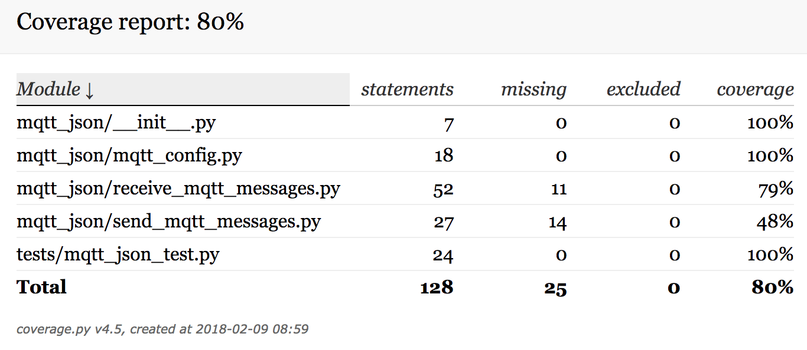
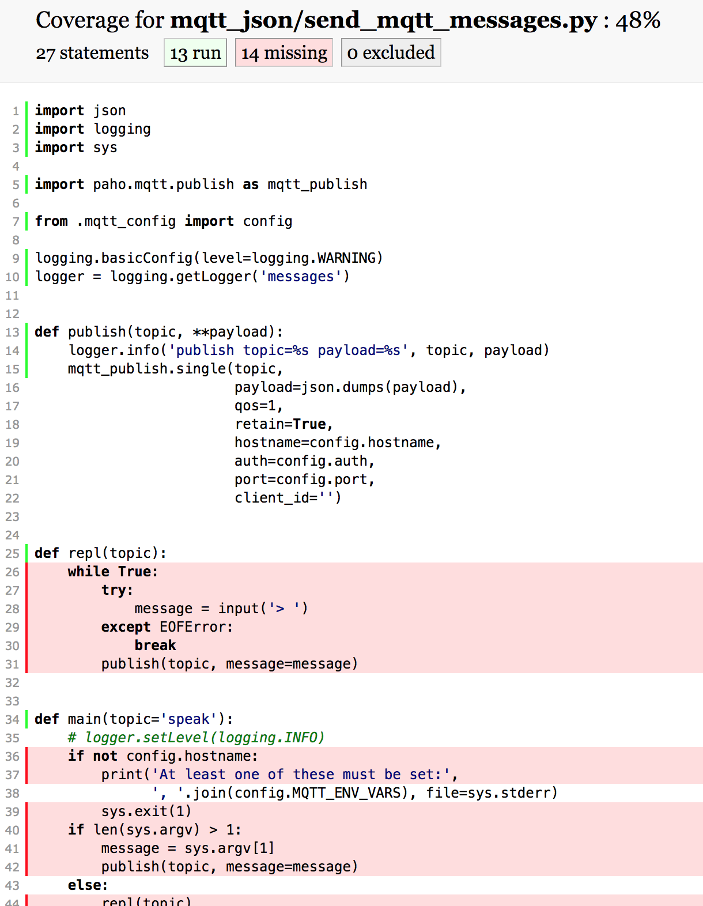

Your *program* implements functionality, aka behavior.

Your *test suite* is supplementary code, that compares the *actual* behavior (from running the program) to the *expected* behavior (that's coded into the test suite). Think of it as double-entry bookkeeping. You have to things twice[^1]; in return, one of these is a check on the other — bugs in your code show up when there's a test case that says what to expect; bugs in your tests show up when they're compared against the correct behavior in your program.

Some parts of your code end up being tested, some don't.

[Code coverage](https://en.wikipedia.org/wiki/Code_coverage) (or test coverage) is a measure of how much of your code is executed by tests.

(There's a few different ways this can be defined. Check out [basic coverage critera](https://en.wikipedia.org/wiki/Code_coverage#Basic_coverage_criteria). It's worth thinking about these as you design your tests.)

A **code coverage tool** runs your test suite against an [instrumented](https://en.wikipedia.org/wiki/Instrumentation_(computer_programming)) version of your program, and reports its coverage.

In pseudo-math[^2]:

* Test suite: $\textit{expected behavior} - \textit{actual-behavior} = \textit{bugs}$
* Code coverage: $\textit{all source code} - \textit{tested source code} = \textit{possible and future bugs}$[^3]


[^1]: Therefore it's important to say things in two *different* ways. One way to write a bad test is to use the same code in the test that you used in the code being tested. One way around this is for the test to implement a different algorithm that implements the same functionality as the code being tested — but this is very expensive, and error prone. More common is to write the test at a *different level of generality and abstraction* — the code being tested works for all values, but the test just spot checks a few, and uses a hard-coded value that you've manually verified.
[^2]: Pseudo-math is great for making hacking look more engineering-y. But for extra fake legitimacy, nothing beats applying *physics* terms to programming. [And this has been done])()https://en.wikipedia.org/wiki/Heisenbug!
[^³]: We just don't know what's lurking in here, except through manual testing — and then only the version we manually tested.

## Running the Coverage tool

We will use the Coverage tool. [pytest-cov](https://pypi.python.org/pypi/pytest-cov) integrates this with pytest.

First, install them:

```bash
$ pip3 install coverage pytest-cov
```

Now run `pytest` with the `—cov` option, to enable test coverage:

```bash
$ pytest --cov=.
============================== test session starts ===============================
platform darwin -- Python 3.6.4, pytest-3.2.5, py-1.5.2, pluggy-0.4.0
rootdir: /Users/osteele/code/bear, inifile:
plugins: cov-2.5.1
collected 2 items

tests/mqtt_json_test.py ..

---------- coverage: platform darwin, python 3.6.4-final-0 -----------
Name                                 Stmts   Miss  Cover
--------------------------------------------------------
mqtt_json/__init__.py                    7      0   100%
mqtt_json/mqtt_config.py                18      0   100%
mqtt_json/receive_mqtt_messages.py      52     11    79%
mqtt_json/send_mqtt_messages.py         27     14    48%
tests/mqtt_json_test.py                 24      0   100%
--------------------------------------------------------
TOTAL                                  128     25    80%


============================ 2 passed in 0.14 seconds ============================

```

This reports the number of statements, per file, that the test suite[^4]  invokes.

You could add  `--cov-report term-missing` in order to see the line numbers of uncovered statements, next each file. See the [pytest-cov](https://pypi.python.org/pypi/pytest-cov) for more on this.

We're going to go down a different route: creating an HTML file that displays the source code, annotated with coverage information:

```bash
$ pytest --cov=. --cov-report html:coverage
```

This places a report in the `coverage` subdirectory of the current directory. (That's the `coverage` in the `html:coverage` argument.) Open `./coverage/index.html` in a browser[^5]. It looks like this:



So far, just a different view of was printed in the terminal earlier. Here's where it differs. Click on one of the filenames to view a page like this:



The red shows code that the test suite doesn't cover. The main function code is covered; the functions that add a command-line interface, for interactively testing this function, aren't. (In a program whose point was the command-line interface, I'd go ahead and add unit tests for `repl` and `main`. I'd also do this if I wanted to refactor them, or had issues with regressions in those functions.) Here's another file:


Takeways from this file:

* The logging code isn't executed. The test suite could test these by setting the logging level.
* The exception clause (`except socket.error`) isn't tested. This is typical. To make a robust proram I'd want to test this.
* In fact, the exception clause doesn't look very well thought-out. Unlike the rest of the file, it prints directly to standard error instead of using the logger. And, continuing without subscriptions probably doesn't make sense here — it changes what should be a hard failure into a more subtle error, where things just don't work and you need to look back through the output to notice why. The function should throw an error instead (or just not catch this one). This issue — that the error case is underdesigned or absent — is also typical.

## Configuring Coverage

You may have noticed that the coverage tool reports the coverage of the test file itself. This is harmless, but annoying. It distracts from the code that's actually meant to be covered, and also gives misleading statistics, if you're tracking those.

You can tell Coverage to ignore certain files, by adding a section to the project's  `setup.cfg`  file[⁶][⁷]. 

```ini
[coverage:report]
omit =
    tests/*
```

Now `pytest --co=.` and `pytest --cov=. --cov-report html:coverage` will omit the file(s) in `./tests` from the coverage report. (Pytest still *runs* this file.)

Similarly, maybe we don't care to test `logger.info` lines, and don't want them cluttering up our annotations and stats with false positives. (If the only issues reported are the ones you care about, it's easier to tell what to focus on. And it's easier to tell when something turns red, than when a count increases by one.) Add  `exclude_lines`  to the `[coverage:report]` section to ignore occurrences of `logger.info`.

```ini
[coverage:report]
exclude_lines =
    logger.info
omit =
    tests/*
```


[^⁴]: Currently just the one file `tests/mqtt_json_test.py`.
[^⁵]: On macOS, you can do this from the command line: `open ./coverage/index.html `. On Ubuntu, `firefox ./coverage/index.html` or `google-chrome ./coverage/index.html` may work.
[^⁶]: We created this file when we configured `flake8`, and updated it with an `[isort]` section in order to configure `flake8-isort`.
[^7]: You could also specify the file(s) to omit as a command-line option to `pytest`. Putting it in the configuration file means it's shared across time — you'll get the benefit of the options later — and space — your collaborators and CI server will use the same options.

